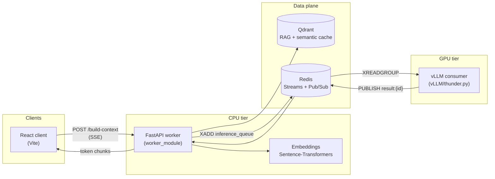

# DistroLLM (distro_llm)

Distributed RAG chat pipeline: **CPU workers** embed queries, retrieve context from **Qdrant**, enqueue jobs on **Redis Streams**, and stream answers from **GPU nodes** running **vLLM** back to clients over HTTP. A **React** UI talks to the worker API; **Terraform** can stand up the stack on **DigitalOcean**.

---

## Table of contents

- [Architecture](#architecture)
- [Repository layout](#repository-layout)
- [Request lifecycle](#request-lifecycle)
- [Prerequisites](#prerequisites)
- [Quick start (local)](#quick-start-local)
- [Configuration](#configuration)
- [HTTP API](#http-api)
- [Redis protocol](#redis-protocol)
- [GPU worker (vLLM)](#gpu-worker-vllm)
- [Cloud deployment](#cloud-deployment)
- [Troubleshooting](#troubleshooting)
- [Further reading](#further-reading)

---

## Architecture



- **One path** serves cache hits from Qdrant only (no GPU).
- **The default path** runs embed → RAG → enqueue → subscribe to `result:{request_id}` → stream tokens until `is_final`.

---

## Repository layout

| Path | Role |
|------|------|
| [`worker_module/`](worker_module/) | FastAPI orchestrator: embeddings, Qdrant RAG + semantic cache, Redis queue and result fan-out, SSE streaming. |
| [`client/`](client/) | React + Vite chat UI; calls the worker over HTTP. |
| [`vLLM/`](vLLM/) | Async vLLM engine that consumes Redis Stream jobs and publishes token deltas to Redis Pub/Sub. |
| [`terraform/`](terraform/) | DigitalOcean infrastructure (workers, Redis, load balancer, VPC, optional autoscale notes). |

---

## Request lifecycle

1. **Client** sends `POST /build-context` with `{ "text": "..." }`.
2. **Worker** embeds the text (thread pool + `sentence-transformers`).
3. **Semantic cache** (Qdrant collection `CACHE_COLLECTION`): if a near-duplicate query exists, the worker streams the cached answer and skips GPU work.
4. **RAG**: vector search in `QDRANT_COLLECTION` returns top‑k chunks with scores ≥ `RAG_SCORE_THRESHOLD`.
5. **Dispatch**: job JSON is `XADD`’d to the Redis stream (`REDIS_STREAM_KEY`, default `inference_queue`). The worker subscribes to `result:{request_id}` **before** enqueueing so no early tokens are missed.
6. **GPU consumer** (`thunder.py`) reads the stream with a consumer group, runs vLLM, and `PUBLISH`es JSON messages to `result:{request_id}`.
7. **Worker** forwards each message as **Server-Sent Events** (`text/event-stream`) to the browser. After the final chunk it may **write** the full answer into the semantic cache collection.

---

## Prerequisites

| Component | Notes |
|-----------|--------|
| **Python 3.11+** | Worker Docker image uses 3.11; local runs should match for fewer surprises. |
| **Node.js 18+** | For the Vite client. |
| **Redis 7** | Streams + Pub/Sub; password optional via URL. |
| **Qdrant** | Local (`localhost:6333`) or cloud (`QDRANT_URL` + `QDRANT_API_KEY`). Collections must exist (see [`worker_module/setup_qdrant.py`](worker_module/setup_qdrant.py)). |
| **CUDA + vLLM** | Only on machines running `vLLM/thunder.py`; not required for the CPU worker or static client build. |
| **Terraform 1.x** | Only if you deploy [`terraform/`](terraform/). |

---

## Quick start (local)

### 1. Qdrant and indexes

Point `worker_module/.env` at your Qdrant instance (see [Configuration](#configuration)), then from `worker_module/`:

```bash
pip install -r requirements.txt
python setup_qdrant.py
```

This creates the **RAG** collection (`QDRANT_COLLECTION`, default `my_docs`) and the **semantic cache** collection (`CACHE_COLLECTION`, default `semantic_cache`) and seeds sample documents.

### 2. Redis + worker (Docker Compose)

From `worker_module/`:

```bash
# Create worker_module/.env with at least Redis and Qdrant settings (see Configuration)
docker compose up --build
```

Compose starts **Redis** and the **context-builder** service on port **8000**. Ensure `.env` contains at least `QDRANT_HOST` / `QDRANT_PORT` or `QDRANT_URL` so the worker can reach Qdrant (Qdrant is not defined in this compose file by default).

### 3. GPU consumer (optional, separate host)

On a GPU machine with vLLM installed, from the `vLLM/` directory (so `config.yaml` resolves):

```bash
pip install vllm redis pyyaml python-dotenv
set REDIS_URL=redis://localhost:6379
python thunder.py
```

Edit [`vLLM/config.yaml`](vLLM/config.yaml) for model name, memory utilization, and vLLM engine limits.

### 4. Web client

From `client/`:

```bash
npm install
```

Create `client/.env`:

```env
VITE_API_URL=http://localhost:8000
```

```bash
npm run dev
```

Open the URL Vite prints (typically `http://localhost:5173`).

> **CORS:** If the API and dev server use different origins, configure CORS on FastAPI or a Vite dev proxy. See [`client/README.md`](client/README.md).

Production static build + nginx: see [`client/README.md`](client/README.md) and [`client/Dockerfile`](client/Dockerfile).

---

## Configuration

Worker settings are **environment variables** loaded from `worker_module/.env` (see [`worker_module/config.py`](worker_module/config.py)).

| Variable | Default | Purpose |
|----------|---------|---------|
| `EMBEDDING_MODEL` | `all-MiniLM-L6-v2` | Sentence-transformers model id. |
| `THREAD_POOL_SIZE` | CPU count | Threads for `model.encode`. |
| `QDRANT_URL` | *(empty)* | Remote Qdrant base URL; if set, used instead of host/port. |
| `QDRANT_API_KEY` | *(empty)* | Cloud Qdrant API key. |
| `QDRANT_HOST` | `localhost` | Local Qdrant host. |
| `QDRANT_PORT` | `6333` | Local Qdrant port. |
| `QDRANT_COLLECTION` | `my_docs` | RAG collection name. |
| `RAG_TOP_K` | `5` | Chunks retrieved per query. |
| `RAG_SCORE_THRESHOLD` | `0.6` | Minimum similarity for RAG hits. |
| `CACHE_COLLECTION` | `semantic_cache` | Semantic cache collection. |
| `CACHE_SIMILARITY_THRESHOLD` | `0.92` | Minimum similarity for cache hit. |
| `REDIS_URL` | `redis://localhost:6379` | Redis connection URL. |
| `REDIS_STREAM_KEY` | `inference_queue` | Stream name for GPU jobs (**must match** `thunder.py`). |
| `REDIS_STREAM_MAXLEN` | `10000` | Approximate max stream length. |
| `RESULT_TIMEOUT_SEC` | `60` | Max wait for GPU chunks per request. |
| `MAX_CONCURRENT_PER_PROCESS` | `250` | Semaphore for embed/RAG/dispatch phase. |
| `HOST` / `PORT` | `0.0.0.0` / `8000` | Uvicorn bind. |
| `UVICORN_WORKERS` | `1` | Process count in `main.py`. |

GPU script [`vLLM/thunder.py`](vLLM/thunder.py) uses:

| Variable | Default | Purpose |
|----------|---------|---------|
| `REDIS_URL` | `redis://localhost:6379` | Redis for stream + pub/sub. |
| `REDIS_KEY` | *(none)* | Redis password if required. |

Model and engine args come from [`vLLM/config.yaml`](vLLM/config.yaml).

---

## HTTP API

Base URL: worker root (e.g. `http://localhost:8000`). All JSON bodies use UTF-8.

### `GET /health`

Returns JSON such as `{"status":"ok"}` — used for probes and load balancers.

### `POST /build-context`

**Request body** ([`InferRequest`](worker_module/models.py)):

```json
{ "text": "Your question or prompt" }
```

**Response:** `Content-Type: text/event-stream` (SSE).

Each event line looks like:

```text
data: {"chunk":"...","is_final":false}
```

Terminal event:

```text
data: {"chunk":"","is_final":true}
data: [DONE]
```

Cache hits may include `"cache_hit": true`. Errors may appear as JSON with an `error` field in the payload (see worker implementation).

Integrators should **parse SSE `data:` lines** (strip the `data: ` prefix, then JSON-parse) or use an SSE-aware client.

---

## Redis protocol

| Mechanism | Key / pattern | Payload |
|-----------|----------------|---------|
| **Stream** | `inference_queue` (configurable via `REDIS_STREAM_KEY`) | Field `data`: JSON with `request_id`, `prompt`, `context` (list of chunk dicts), `embedding`, metadata. |
| **Consumer group** | Group `gpu_workers` (in `thunder.py`) | Used by vLLM workers; create is idempotent. |
| **Pub/Sub** | `result:{request_id}` | JSON: `chunk`, `is_final`, optional `error`. |

Stream entries are acknowledged (`XACK`) by the GPU consumer after a successful final generation.

---

## GPU worker (vLLM)

[`vLLM/thunder.py`](vLLM/thunder.py) builds a prompt from RAG `context` chunks and the user `prompt`, runs `AsyncLLMEngine.generate`, and publishes incremental text to `result:{request_id}`.

Requirements:

- Working **Redis** reachable at `REDIS_URL`.
- **`config.yaml`** in the current working directory when launching the script.
- **vLLM** and a compatible **GPU / driver** stack for the chosen `model` in `config.yaml`.

Keep **`REDIS_STREAM_KEY`** in the CPU worker aligned with the stream name consumed in `thunder.py` (default `inference_queue`).

---

## Cloud deployment

For DigitalOcean (droplets, Redis, load balancer, firewall, VPC, scaling notes):

- [`terraform/README.md`](terraform/README.md)
- [`terraform/DEPLOYMENT_GUIDE.md`](terraform/DEPLOYMENT_GUIDE.md)

Create a `terraform/terraform.tfvars` with your provider token and sizing; `terraform.tfvars` is gitignored. Use `terraform output` for load balancer and Redis addresses after apply.

---

## Troubleshooting

| Symptom | Things to check |
|---------|------------------|
| **503 from Qdrant** | Qdrant running; `QDRANT_URL` / host+port; collections created (`setup_qdrant.py`). |
| **503 queue / dispatch** | Redis up; `REDIS_URL` correct from worker and GPU host. |
| **No tokens / timeout** | GPU consumer running; same Redis; stream and consumer group healthy; GPU logs for OOM or model errors. |
| **Stream never drains** | Consumer group name / consumer process; stuck pending messages (`XPENDING`). |
| **Client shows no text** | Response is SSE with a `data: ` prefix — parsers must strip it before `JSON.parse`. The metrics bar in the sample UI may still display `/infer`; the implemented route is **`/build-context`**. |
| **CORS in dev** | Align origins or add a Vite proxy / FastAPI CORS middleware. |

---

## Further reading

| Document | Content |
|----------|---------|
| [`client/README.md`](client/README.md) | Vite scripts, Docker build args, legacy NDJSON notes vs current SSE worker. |
| [`terraform/README.md`](terraform/README.md) | DO resources, outputs, autoscale script outline. |

---

## License

No root license file is present in this repository; add one if you open-source or distribute the project.
